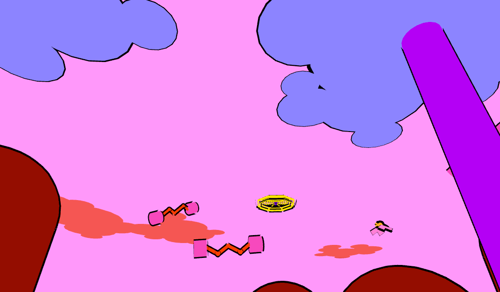

# Kami

OpenGL build: http://omono.me/kami/index.html

Kami is a musical stand-in-one-spot-and-wave-your-hands-around simulator for Oculus VR and Leap Motion.

Sadly, you can't play Kami as a VR experience, 'cause browser VR doesn't exist (yet). Instead, you can play a WebGL port using the mouse to look, the left button to pull on critters, and the right button to push critters away.

Final project for 21M.359 Interactive Music Systems, Fall 2016. (Originally titled "Musicritters" or "Critters".)

## Screenshots

